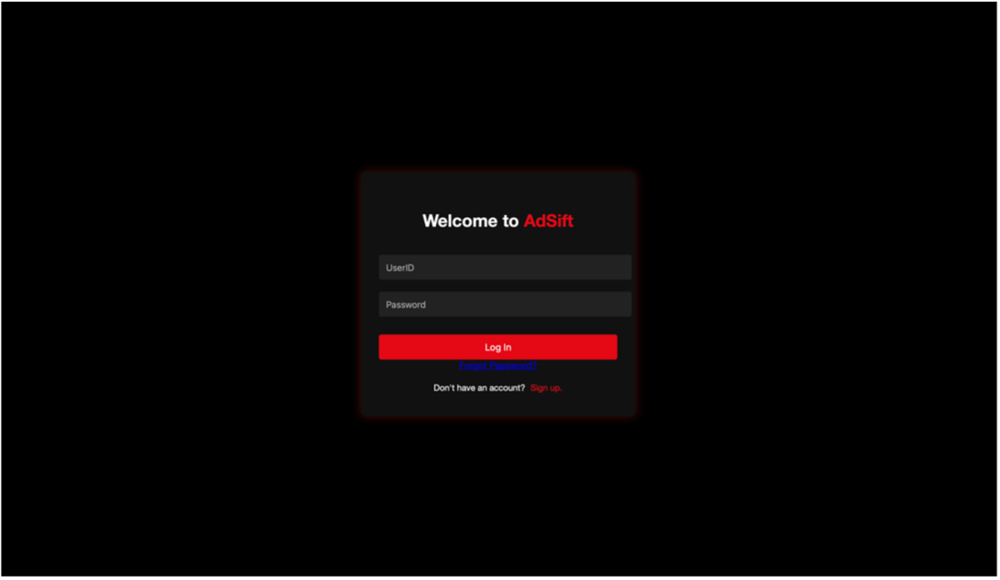
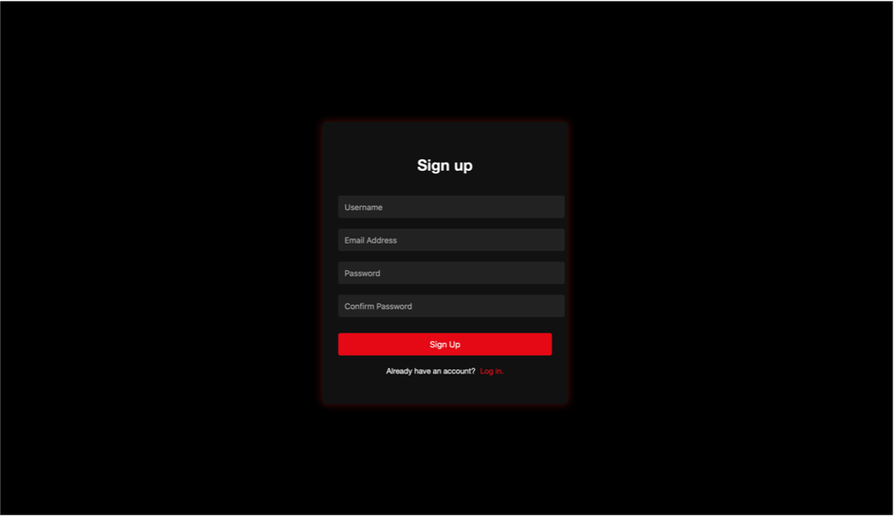

# 🔐 ADSIFT Authorization React Web App

This is a simple React-based authorization module designed as part of the **ADSIFT** project. It includes user-friendly interfaces for login, signup, and a protected home screen with a welcome message.


## 📸 Screenshots

| Login Page | Signup Page | Welcome Page |
|------------|-------------|-----------|
|  |  |  |

## ⚙️ Features

- ✅ User login interface  
- 📝 Signup form for new users  
- 🏠 Home page after authentication  
- 🌐 Built with **React + Vite**


## 📁 Project Structure
``` markdown
AUTHORIZATION WEB APP REACT/
├── .github/
├── node_modules/
├── public/
│   └── logos.png
├── src/
│   ├── components/      # Reusable components (e.g., forms, buttons)
│   ├── styles/          # CSS / SCSS styles
│   ├── App.jsx
│   └── main.jsx
├── .gitignore
├── eslint.config.js
├── index.html
├── package.json
├── package-lock.json
└── vite.config.js
```

## 🚀 Getting Started

### 🔧 Prerequisites

- Node.js (v16 or above)
- npm or yarn

### ⚙️ Installation & Running Locally

```bash
# Clone the repository
git clone https://github.com/Kavin-Antony/ADSIFT-AUTHORIZATION_REACT_WEB_APP.git

# Navigate into the project directory
cd "AUTHORIZATION WEB APP REACT"

# Install dependencies
npm install

# Run the development server
npm run dev
```

🌐 Technologies Used
	•	⚛️ React.js (with Vite)
	•	📦 NPM
	•	🎨 CSS Modules / Styles
	•	🧪 ESLint


 🔗 Related Repositories
```markdown
- [ADSIFT Web App React without AD (AD SKIPPER BACKEND)](https://github.com/Kavin-Antony/ADSIFT-WEB_APP_REACT_WITHOUT_AD)
- [ADSIFT Web App React with AD](https://github.com/Kavin-Antony/ADSIFT-AUTHORIZATION_REACT_WEB_APP)
- [ADSIFT Server](https://github.com/Kavin-Antony/ADSIFT---Server)
```
